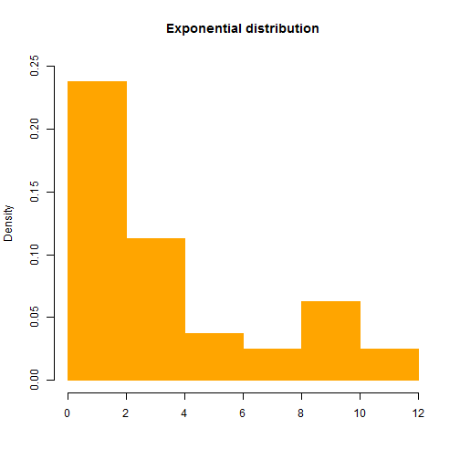
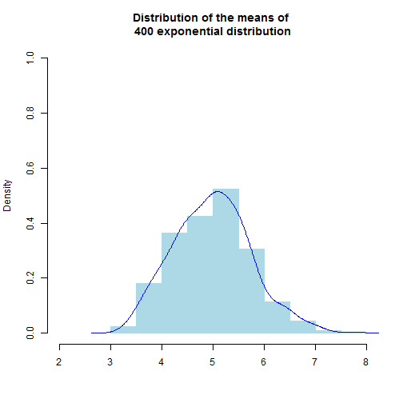

See Central Limit Theorem with shiny app
========================================================
transition:zoom
transition-speed:default
type:sub-section
font-family:'Helvetica'
autosize: true
Brief introduction to my shiny app


Central limit theorem
============================
transition:rotate

- <small>The central limit theorem (CLT) states that given certain conditions, the arithmetic mean of a sufficiently large number of iterates of independent random variables, each with a well-defined expected value and well-defined variance, will be approximately normally distributed, regardless of the underlying distribution.         

   (from Wikipedia)</small>
                                                  
Shiny app introduction
========================================================


- This shiny app presents a visualization of Central Limit Theorem by simulating exponential distribution in R. 
- What you should do is to **choose the time of simulation**.Then the app will do:
   + First generate an exponential variable with lambda = 0.2 and sample size=40
   + Then simulation this exponential distibution many times, calculate the mean of the distribution each time.
   + Finally plot the original distribution and distribution of the means.


Exponential distibution 
========================================================
transition:zoom

 

***

- Here is the code:


```r
set.seed(7645)
a<-rexp(40,0.2)
hist(a,main="Exponential distribution",
xlab="",col="orange",
border="orange",
ylim=c(0,0.25),freq=F)
```

- This is an exponential distibution with lambda = 0.2 and sample size=40. Pay attention to it's shape.

Distribution of the means
==========================
autosize: true

 

***

- You can choose any value of times of simulation in the range from 5 to 800 in slider. For example, if you choose Times=400, the app will show the left plot.
- You can see that distribution of means looks far more Gaussian than the original exponential distribution as time of simulation increasing.
- **So,try it!**

